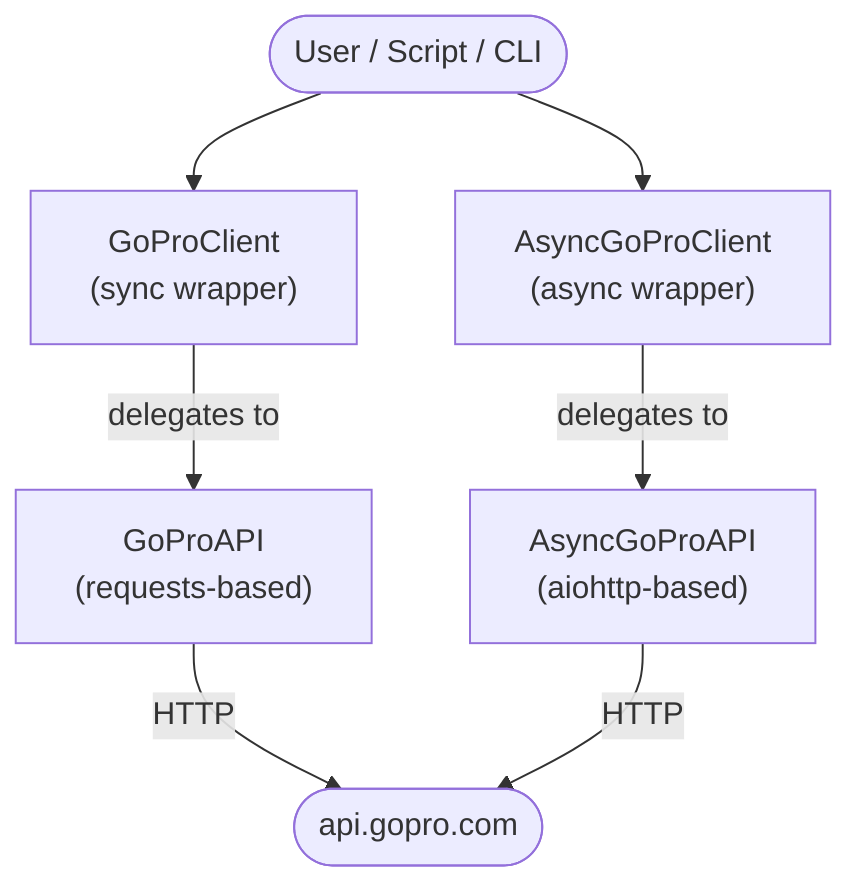
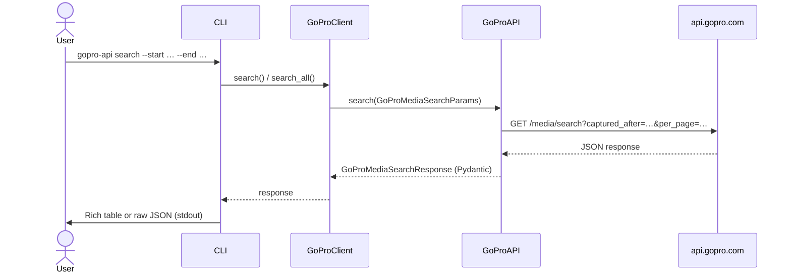
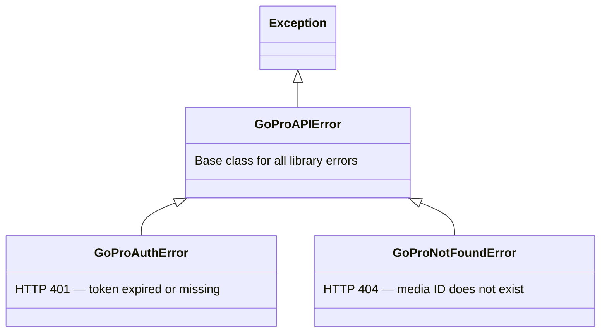

# Architecture

This page describes the internal design of **gopro-api** — how the layers fit together, how data flows from an HTTP request to a typed Python object, and where to look when you want to extend the library.

## High-level overview



## Package layout

| Path | Role |
|------|------|
| `gopro_api/api/gopro.py` | `GoProAPI` — synchronous HTTP client (`requests`) |
| `gopro_api/api/async_gopro.py` | `AsyncGoProAPI` — asynchronous HTTP client (`aiohttp`) |
| `gopro_api/api/models.py` | Pydantic request/response models |
| `gopro_api/api/__init__.py` | Re-exports `GoProAPI`, `AsyncGoProAPI` |
| `gopro_api/client.py` | `GoProClient` / `AsyncGoProClient` — high-level wrappers |
| `gopro_api/config.py` | pydantic-settings `Settings` (`GP_ACCESS_TOKEN`) |
| `gopro_api/exceptions.py` | Custom exception hierarchy |
| `gopro_api/utils.py` | Shared helpers (resolution scoring, etc.) |
| `gopro_api/cli/` | Typer application — `search`, `info`, `pull` commands |

## Layers

### 1. HTTP clients (`gopro_api.api`)

`GoProAPI` and `AsyncGoProAPI` are thin wrappers around HTTP calls. They:

- Inject the `gp_access_token` cookie on every request.
- Validate and deserialise responses into Pydantic models.
- Raise typed exceptions (`gopro_api.exceptions`) on non-2xx responses.

Both are context-managers that handle session lifecycle:

```python
with GoProAPI() as api:        # opens a requests.Session
    result = api.search(...)

async with AsyncGoProAPI() as api:  # opens an aiohttp.ClientSession
    result = await api.search(...)
```

### 2. High-level clients (`gopro_api.client`)

`GoProClient` and `AsyncGoProClient` add convenience on top of the raw API:

- **Pagination** — `--all-pages` iteration over `search` results.
- **Asset selection** — picking the best video variation by resolution.
- **File download** — streaming CDN downloads to disk.

### 3. Pydantic models (`gopro_api.api.models`)

All request parameters and API responses are typed with [Pydantic v2](https://docs.pydantic.dev/) models:

- **Requests** — `GoProMediaSearchParams`, `CapturedRange`.
- **Responses** — `GoProMediaSearchResponse`, `GoProMediaDownloadResponse`, and their `_embedded` / `_pages` children (with field aliases for the GoPro API's underscore-prefixed keys).

List fields in request models are serialised to comma-separated strings automatically when calling `model_dump()`.

### 4. Configuration (`gopro_api.config`)

A single `Settings` class (pydantic-settings) reads `GP_ACCESS_TOKEN` from:

1. Environment variables.
2. A `.env` file in the current working directory.

Clients accept an explicit `access_token` parameter that overrides `Settings`.

### 5. CLI (`gopro_api.cli`)

The CLI is built with [Typer](https://typer.tiangolo.com/) and [Rich](https://github.com/Textualize/rich):

- `gopro_api/cli/app.py` — Typer application and shared options.
- `gopro_api/cli/search.py` — `search` command + `SearchPrinter`.
- `gopro_api/cli/info.py` — `info` command + `InfoPrinter`.
- `gopro_api/cli/pull.py` — `pull` command + `PullPrinter`.
- `gopro_api/cli/_common.py` — shared helpers.

Each command delegates to `GoProClient`/`AsyncGoProClient` and passes the result to a dedicated `*Printer` class for Rich-formatted output.

## Data flow — `gopro-api search`



## Error handling



| Exception | Raised when |
|-----------|-------------|
| `GoProAPIError` | Base class for all library errors. |
| `GoProAuthError` | The API returns **401 Unauthorized** (token expired or missing). |
| `GoProNotFoundError` | The API returns **404** (media ID does not exist). |

See `gopro_api/exceptions.py` and [API Reference → Exceptions](api/exceptions.md) for the full hierarchy.

## Extending the library

**New API endpoint** — add a method to `GoProAPI` / `AsyncGoProAPI` (and the corresponding Pydantic models), then expose it in `GoProClient` / `AsyncGoProClient`.

**New CLI command** — create a new file under `gopro_api/cli/`, define a Typer command, register it in `app.py`, and add a `*Printer` class for output formatting.
